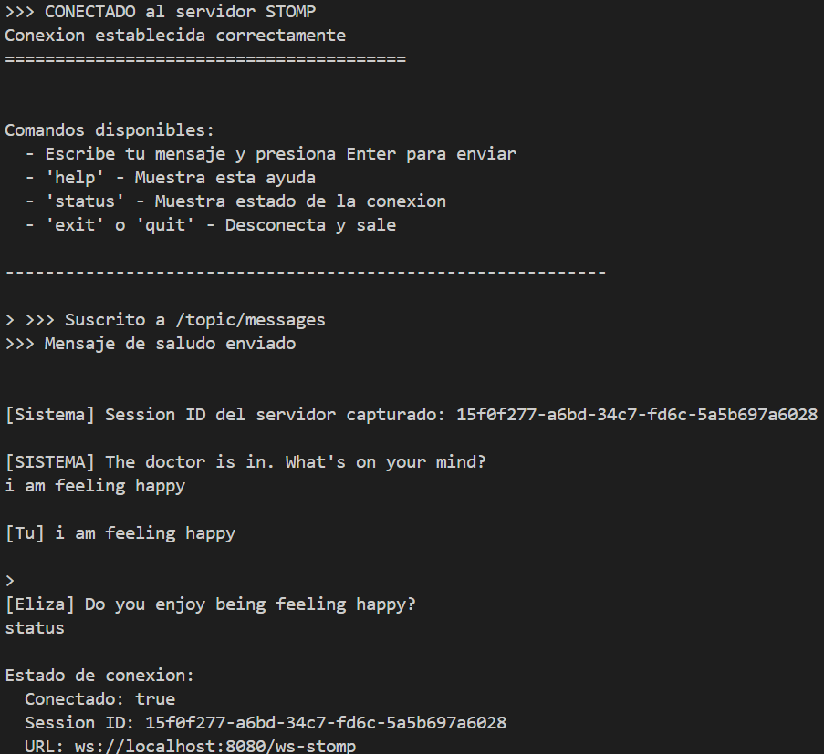
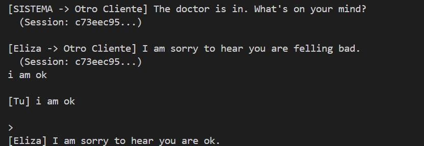
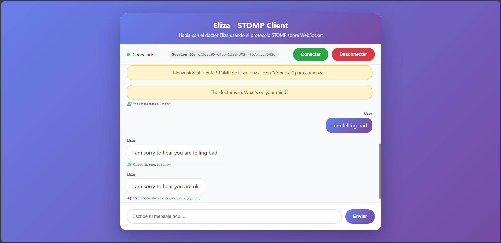
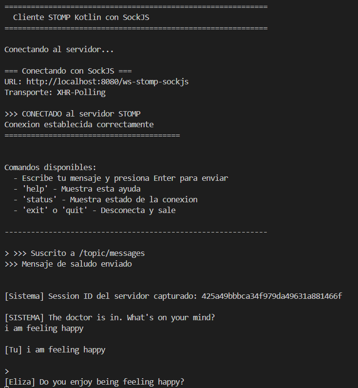
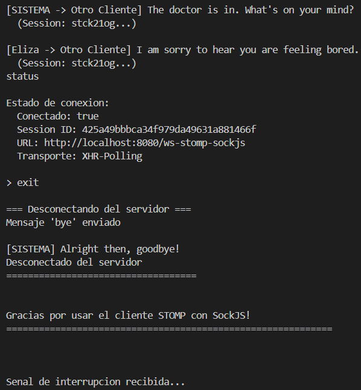
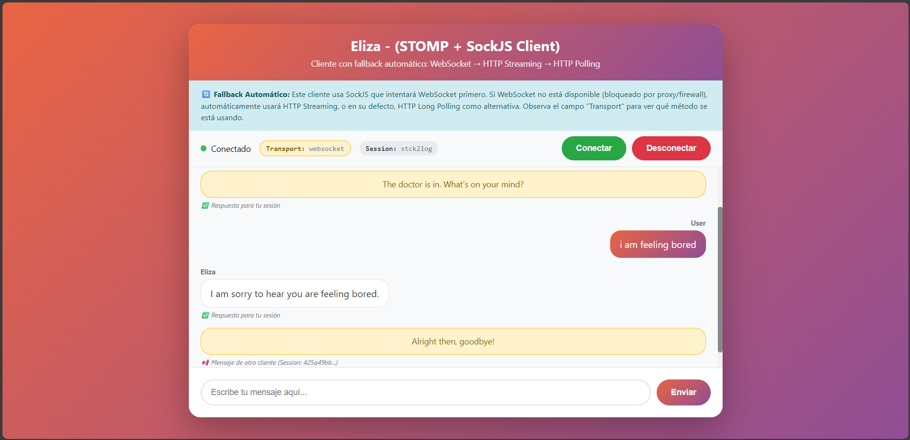
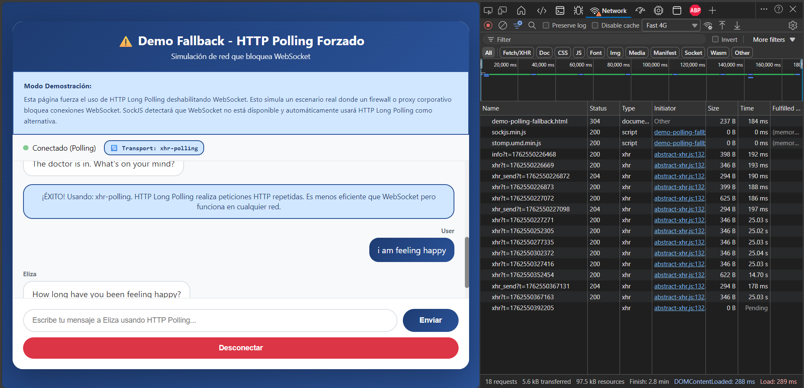
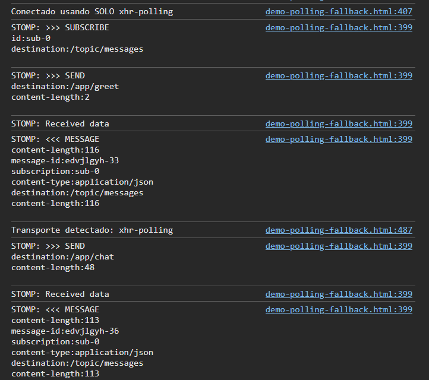
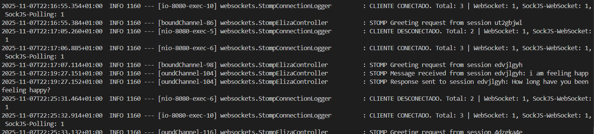

# Lab 4 WebSocket -- Project Report

## Description of Changes

### 1. Completion of ElizaServerTest.kt

The first significant change involved **completing the implementation of the `onChat` test** in the `ElizaServerTest.kt` file. This test was initially marked with `@Ignore` annotation and required implementation to verify the bidirectional communication between a WebSocket client and the Eliza server.

The implementation focused on testing the complete conversation flow: the client connects to the server, receives the initial greeting messages, sends a test message ("I am feeling sad"), and verifies that Eliza responds with an appropriate therapeutic question. The test uses a `CountDownLatch` to coordinate asynchronous message reception between threads and employs interval-based assertions rather than exact equality checks to handle the asynchronous nature of WebSocket communication.

An important discovery during this implementation was understanding why `assertEquals` cannot be used for checking the exact number of messages received. Since WebSocket communication is asynchronous, the different threads can progress at different rates. The final message might not have arrived when `latch.await()` completes and assertions begin. Therefore, the test verifies that the message count falls within an expected interval (between 4 and 5 messages) rather than demanding an exact count. The test also validates that Eliza's response is one of the possible therapeutic responses from her response set.

### 2. STOMP Protocol Implementation

The second major enhancement was the **implementation of STOMP (Simple Text Oriented Messaging Protocol) support** for WebSocket communication. This involved creating the `StompElizaController` class that handles STOMP messaging through Spring's messaging annotations.

The controller implements two primary message mappings: `/app/chat` for handling user messages and `/app/greet` for initial connection greetings. These methods use the `@MessageMapping` annotation to receive messages from clients and `@SendTo` annotation to broadcast responses to all subscribers on the `/topic/messages` topic. This implements a **_publish-subscribe pattern_** where multiple clients can receive the same messages.

The implementation introduces data classes `ChatMessage` and `ChatResponse` to structure the message exchange, along with a `MessageType` enum to distinguish between regular chat messages and system messages. The controller also detects goodbye messages and responds with appropriate farewell responses, demonstrating content-aware message processing.

To verify the STOMP implementation, a **terminal-based Kotlin client** (`StompClientKotlin.kt`) was developed that connects to the server using pure STOMP over WebSocket. This console client provides an interactive command-line interface where users can send messages to Eliza and receive responses in real-time. The client demonstrates proper STOMP frame handling, session management, and message serialization using Jackson for JSON conversion.

Command to run the client:

```
./gradlew runStompClientKotlin --console=plain
```

Terminal STOMP client:





Additionally, with AI assistance, **web-based HTML/CSS/JavaScript client** was created to provide a more visual interface. The `stomp-client.html` file implements a browser-based chat interface that uses the STOMP.js library to connect via pure WebSocket to the `/ws-stomp` endpoint. This visual client showcases real-time messaging with a polished user interface including message history, connection status indicators, and styled message bubbles.

[URL](http://localhost:8080/stomp-client.html) to the STOMP web client.



### 3. SockJS Fallback Support

The third major change was the **addition of SockJS support** to provide WebSocket compatibility across different network environments. SockJS is a JavaScript library that provides a WebSocket-like API but falls back to alternative transports when WebSocket is blocked by firewalls or proxies.

The implementation configures SockJS with three transport options in order of preference: WebSocket, XHR-Streaming (HTTP streaming), and XHR-Polling (HTTP long polling). The `StompWebSocketConfig` class registers the `/ws-stomp-sockjs` endpoint with SockJS enabled, allowing automatic transport negotiation based on network conditions.

To test SockJS functionality, a **terminal client** (`SockJsStompClient.kt`) was implemented with the ability to specify which transport to use via command-line arguments. Users can launch the client with "websocket", "xhr-streaming", or "xhr-polling" as arguments to test each transport independently. The client provides detailed connection information, transport detection, and handles all three transport types correctly.

A critical discovery during implementation of client was the `setXhrStreamingDisabled` method on the `RestTemplateXhrTransport` class. Initially, attempts to force XHR-Polling as a fallback were unsuccessful because SockJS would default to XHR-Streaming. Only after discovering this configuration option was it possible to properly test pure polling scenarios by explicitly disabling the streaming transport.

Command to run the client:

```
./gradlew runSockJsClient --args='websocket' --console=plain
./gradlew runSockJsClient --args='xhr-streaming' --console=plain
./gradlew runSockJsStompClient --args='xhr-polling' --console=plain
```

Terminal SockJS client:





Two **web-based SockJS clients** were also created with AI assistance. The `stomp-sockjs-client.html` follows SockJS's default priority order (WebSocket, XHR-Streaming and XHR-Polling) and automatically selects the best available transport. The `demo-polling-fallback.html` is specifically designed to demonstrate the polling fallback by disabling WebSocket and streaming transports, forcing the use of pure XHR-Polling. This demonstrates that the application remains functional even in the most restrictive network environments.

[URL](http://localhost:8080/stomp-sockjs-client.html) to the SOCKJS web client.



[URL](http://localhost:8080/demo-polling-fallback.html) to the demo polling fallback.





### 4. Comprehensive Integration Tests

The fourth major change was the **implementation of `StompElizaControllerTest`**, a integration test suite that verifies STOMP and SockJS functionality in a Spring Boot test environment. These integration tests start the entire Spring application on a random port and make real network connections.

The test suite includes seven test cases organized into logical categories: context loading verification, pure STOMP endpoint connection, SockJS endpoint connection with WebSocket transport, SockJS endpoint connection with XHR fallback, message exchange and Eliza response verification, goodbye message handling, and multi-client concurrent message broadcasting.

A key discovery during test implementation was the `BlockingQueue` data type, specifically `LinkedBlockingQueue`, which was previously unknown. This thread-safe queue is perfect for collecting asynchronously received messages in tests. The `poll` method with timeout allows tests to wait for expected messages without blocking indefinitely, and multiple test clients can each have their own queue to verify that broadcast messages reach all subscribers.

The tests verify both connection mechanisms (pure STOMP and SockJS with multiple transports) and validate the complete message flow including JSON serialization, STOMP frame processing, topic subscription, message broadcasting to all suscribers, and Eliza response generation. The multi-client test is particularly important as it confirms that the publish-subscribe pattern works correctly, with all connected clients receiving messages sent by any client.

### 5. Connection Logging and Statistics

The fifth enhancement was the **implementation of connection logging** to track connected clients and their transport types. This was achieved through WebSocket and STOMP interceptors that monitor connection lifecycle events.

The `WebSocketConnectionLogger` class implements the `HandshakeInterceptor` interface to detect transport types during the initial WebSocket handshake. By examining the request URI, it identifies whether the connection is pure WebSocket, SockJS-WebSocket, SockJS-Streaming, or SockJS-Polling, and stores this information in the session attributes for later access.

The `StompConnectionLogger` class implements the `ChannelInterceptor` interface to intercept STOMP protocol messages. It listens for `CONNECT` and `DISCONNECT` commands to maintain a real-time count of active sessions grouped by transport type. Whenever a client connects or disconnects, the logger displays statistics showing the total number of connected clients and a breakdown by transport type (e.g., "Total: 3 | WebSocket: 2, SockJS-Polling: 1").



These interceptors provide valuable operational visibility into **how clients are connecting to the server**, which is especially useful when testing **fallback scenarios** or debugging connection issues. The logging information appears in the server _console_ and **helps verify that SockJS is correctly detecting and using appropriate transports**.

Throughout the implementation, extensive **inline documentation** was added with links to official JavaDocs and Spring Framework documentation. These comments reference specific interfaces like `HandshakeInterceptor` and `ChannelInterceptor`, providing quick access to official documentation for future maintenance and learning.

---

## Technical Decisions

Throughout the development of this project, several important technical decisions were made regarding WebSocket implementation, testing strategies, transport selection, and client architectures:

### SockJS Integration for Transport Fallback

**SockJS was integrated** to ensure WebSocket compatibility in restrictive network environments where corporate firewalls or proxies might block WebSocket connections. SockJS provides automatic fallback to alternative transports while maintaining a WebSocket-like API. The three transports (WebSocket, XHR-Streaming, XHR-Polling) are configured in order of efficiency and performance. The discovery of **`setXhrStreamingDisabled(true)`** was crucial for testing pure polling scenarios. This configuration allows the demonstration client to force specific transports for educational and testing purposes, while production clients can use SockJS's automatic transport negotiation.

### BlockingQueue for Asynchronous Test Assertions

For integration testing of WebSocket communication, **`LinkedBlockingQueue`** was selected as the **data structure to collect asynchronously received messages**. This choice addresses the fundamental challenge of testing **asynchronous communication**: the test thread needs to wait for messages that arrive on different threads. `BlockingQueue` provides thread-safe operations and the **`poll(timeout, TimeUnit)` method** allows tests to wait for expected messages without blocking indefinitely. This is superior to using regular collections with sleep loops, as it provides both thread safety and precise timeout control. Each test client can maintain its own queue, enabling multi-client tests to verify that broadcast messages reach all subscribers independently.

### Terminal Clients vs Web Clients

Both **console-based Kotlin clients** and **web-based HTML/JavaScript clients** were developed to serve different purposes. The terminal clients (`StompClientKotlin.kt`, `SockJsStompClient.kt`) provide programmatic access to the WebSocket/STOMP functionality and can be easily configured via command-line arguments to test specific transports. These clients are valuable for demonstrating the underlying protocol behavior without browser dependencies. The web clients provide a visual, user-friendly interface suitable for demonstrations and end-user interactions. The web clients also allow easy inspection of network traffic through **browser developer tools**, which is particularly useful for verifying that **SockJS fallback** mechanisms are working correctly (e.g., seeing XHR polling requests in the Network tab).

### Message Type Classification

The implementation distinguishes between **CHAT** and **SYSTEM** message types through the `MessageType` enum. This decision allows clients to handle different message categories appropriately: system messages (connections and disconnections) can be styled differently from regular chat messages in the UI. The message responses also includes an `originalSessionId` field to support publish-subscribe scenarios where clients need to distinguish their own messages from those sent by other clients.

### Interceptor Architecture for Logging

**Two separate interceptors** were implemented rather than a single combined solution: `WebSocketConnectionLogger` at the handshake level and `StompConnectionLogger` at the STOMP protocol level. This **separation of concerns** follows the Single Responsibility Principle. The **handshake interceptor** focuses on **transport detection** during the initial WebSocket setup, while the **STOMP interceptor** handles **protocol-level connection tracking**. This architecture is more maintainable and allows each interceptor to be independently enabled or disabled. The handshake interceptor stores transport information in **session attributes**, making it accessible throughout the session lifecycle without repeated detection logic.

### Test Isolation Strategy

The integration tests use Spring Boot's test support with `@SpringBootTest(webEnvironment = RANDOM_PORT)` to ensure **complete test isolation**. Each test run starts the application on a random port, preventing conflicts with other running instances. The `@BeforeEach` method clears any shared state before each test. Tests use separate client instances and separate message queues to avoid cross-contamination. The `@AfterEach` method ensures proper disconnection of test clients. This multi-layered isolation strategy produces reliable, repeatable tests that can run in any order without interdependencies.

---

## Learning Outcomes

Working on this WebSocket project provided numerous valuable learning experiences across multiple areas including Kotlin language features, WebSocket protocols, Spring messaging framework, asynchronous programming, and testing strategies.

### WebSocket vs STOMP Protocol Selection

The project implements both raw WebSocket (`ElizaServer`) and STOMP-over-WebSocket (`StompElizaController`) to demonstrate different levels of WebSocket abstraction. **Raw WebSocket** provides low-level control and is suitable for simple bidirectional communication, while **STOMP** adds a **messaging protocol layer** that provides features like **_destination routing, message headers, and publish-subscribe patterns_**.

### Discovery of @MessageMapping and @SendTo Annotations

One of the first important discoveries was the Spring messaging annotations **`@MessageMapping` and `@SendTo`**. These annotations dramatically simplify STOMP message handling. `@MessageMapping` designates a method to handle messages sent to a specific destination (e.g., `/app/chat`), similar to how `@GetMapping` works for HTTP requests. `@SendTo` specifies where the method's return value should be broadcast, automatically serializing the return object to JSON and **sending it to all subscribers of that topic**. This declarative approach eliminates repetitive code for message routing, serialization, and subscription management, allowing developers to focus on business logic rather than protocol details.

### Understanding BlockingQueue for Thread Coordination

The **`BlockingQueue` interface and its `LinkedBlockingQueue` implementation** were previously unknown data structures that proved invaluable for testing asynchronous WebSocket communication. Unlike regular collections, blocking queues provide **thread-safe operations** designed for asynchronous scenarios. The `poll(timeout, TimeUnit)` method is particularly useful in tests. It blocks the calling thread until an element is available or the timeout expires, returning `null` on timeout. This eliminates the need for busy-waiting loops or arbitrary sleep statements. The `offer` method used by message handlers is non-blocking and thread-safe, making it perfect for adding messages from WebSocket callback threads. This pattern enables clean, deterministic testing of asynchronous message flows.

### Session ID Tracking and Message Attribution

Working with multi-client scenarios highlighted the importance of **session identification** in publish-subscribe systems. When multiple clients subscribe to the same topic, each receives all messages, but clients may need to distinguish their own messages from others'. The `originalSessionId` field in `ChatResponse` enables this by tagging each message with the session that originated it. Clients can compare this ID with their own session ID (captured from the first message) to implement UI features like "sent by me" vs "sent by others" styling. This pattern is essential for any collaborative or multi-user real-time application.

### Understanding STOMP Frame Structure

Working directly with STOMP protocol provided insights into its **frame-based message structure**. STOMP frames have a command (CONNECT, SEND, SUBSCRIBE, MESSAGE, etc.), headers (key-value pairs), and an optional body. Spring's `StompSessionHandlerAdapter` provides lifecycle hooks (`afterConnected`, `handleTransportError`, `handleException`) that map to different frame types. The `StompFrameHandler` interface handles incoming MESSAGE frames with `getPayloadType` specifying deserialization and `handleFrame` processing the content. Understanding this structure clarified how higher-level abstractions like `@MessageMapping` are implemented underneath. They're essentially mapping STOMP SEND frames to method calls and converting method returns to MESSAGE frames.

---

## AI Disclosure

### AI Tools Used

ChatGPT

### AI-Assisted Work

AI was used for:

- HTML/CSS/JavaScript structure for the three web clients (`stomp-client.html`, `stomp-sockjs-client.html`, `demo-polling-fallback.html`)
- Troubleshooting guidance when XHR-Polling fallback wasn't working correctly, which led to discovering `setXhrStreamingDisabled`
- Improving the clarity, structure, and consistency of this `REPORT.md` document by providing an initial draft and editorial suggestions

The AI assistance primarily focused on the visual web client implementations, which represented front-end work but required substantial customization to integrate with the specific STOMP endpoints and message formats. The AI provided initial scaffolding and patterns that were then adapted to match the server's API and enhanced with additional features like transport detection display and session ID tracking.

For the `demo-polling-fallback.html` client specifically, AI assistance was instrumental in creating a **forced-fallback scenario** that clearly demonstrates polling behavior when other transports are unavailable. This required careful **configuration of SockJS transport lists to disable WebSocket and streaming**.

When encountering issues with SockJS fallback testing, AI assistance helped identify the `setXhrStreamingDisabled` configuration option that was crucial for testing pure polling scenarios.

**Percentage of AI-assisted vs. original work**: Approximately **40%** of the work was AI-assisted. This mainly included the three web-based HTML/CSS/JavaScript clients and some debugging assistance with SockJS configuration.

**Any modifications made to AI-generated code**: All AI-generated web client code was thoroughly reviewed, tested, and modified to ensure correct integration with the Spring WebSocket/STOMP endpoints. Significant customizations included: adding session ID tracking to distinguish messages from different clients, implementing transport type detection and display, and ensuring proper STOMP protocol usage with correct destination paths. The styling and user interface were refined to provide clear visual feedback about connection status and transport types.

### Original Work

The **server-side implementation** was developed without AI assistance, including:

- Completion of `ElizaServerTest.kt`
- Implement `StompElizaController` with message routing, Eliza integration, and response formatting
- `StompWebSocketConfig` configuration for both pure WebSocket/STOMP and SockJS endpoints
- `WebSocketConnectionLogger` and `StompConnectionLogger` interceptors for connection tracking

Both **terminal clients** (`StompClientKotlin.kt` and `SockJsStompClient.kt`) were developed mainly without AI assistance:

- STOMP session handling and lifecycle management
- Transport type configuration via command-line arguments
- Session ID tracking and message attribution logic

The **integration test suite** (`StompElizaControllerTest.kt`) was original work:

- Test structure with multiple connection scenarios (pure STOMP, SockJS with WebSocket, SockJS with XHR)
- Discovery and implementation of `BlockingQueue` for asynchronous message collection
- Multi-client concurrent testing scenarios
- Message flow verification including greeting, chat, and goodbye messages

The **analysis and understanding phase** involved independently studying Spring WebSocket documentation, STOMP protocol specifications, and SockJS architecture to comprehend how these technologies integrate. This included examining Spring's messaging abstractions, understanding the relationship between WebSocket, STOMP, and SockJS layers, and learning how interceptors fit into the connection lifecycle.

My learning process was based on studying the provided codebase structure, reading the JavaDoc documentation for interfaces like `HandshakeInterceptor` and `ChannelInterceptor`, and consulting Spring Framework documentation on WebSocket and messaging support. The official Spring documentation on [WebSocket Support](https://docs.spring.io/spring-framework/reference/web/websocket.html) and [STOMP over WebSocket](https://docs.spring.io/spring-framework/reference/web/websocket/stomp.html) provided foundational knowledge about annotation-based message handling and transport configuration. This self-directed learning enabled understanding of how to properly implement real-time bidirectional communication with fallback support and how to test asynchronous messaging systems.
